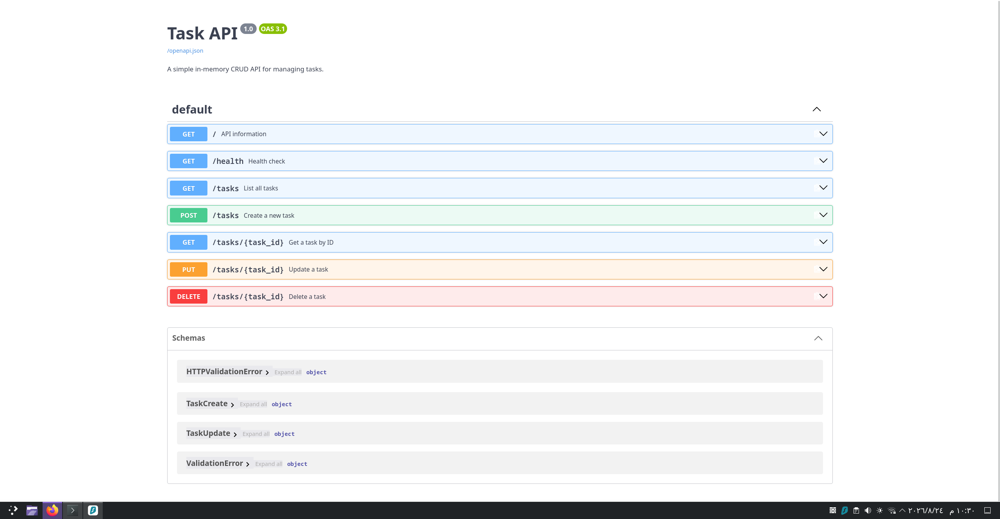

# FastAPI Task API

A simple in-memory CRUD API built with FastAPI.

The API allows users to create, read, update, and delete tasks. Data is stored only in memory, so tasks are reset whenever the server restarts.

## Features

- Create tasks
- List all tasks
- Get a task by ID
- Update task title and completion status
- Delete tasks
- Input validation
- Proper HTTP status codes
- Health-check endpoint
- Interactive Swagger UI documentation

## Tech Stack

- Python 3.10+
- FastAPI
- Uvicorn
- Pydantic
- Swagger UI / OpenAPI

## Project Structure

```text
fastapi-task-api/
├── main.py
├── requirements.txt
├── README.md
└── docs/
    └── swagger.png
```

## Installation

Clone the repository:

```bash
git clone https://github.com/MinaIbrahim10/fastapi-task-api.git
cd fastapi-task-api
```

Create a virtual environment:

```bash
python -m venv .venv
```

Activate it:

```bash
source .venv/bin/activate
```

Install dependencies:

```bash
pip install -r requirements.txt
```

## Run the API

Start the development server:

```bash
uvicorn main:app --reload
```

The API will be available at:

```text
http://localhost:8000
```

Swagger UI:

```text
http://localhost:8000/docs
```

## API Endpoints

| Method | Endpoint | Description |
|---|---|---|
| GET | `/` | API information |
| GET | `/health` | Health check |
| GET | `/tasks` | List all tasks |
| GET | `/tasks/{task_id}` | Get a task by ID |
| POST | `/tasks` | Create a new task |
| PUT | `/tasks/{task_id}` | Update an existing task |
| DELETE | `/tasks/{task_id}` | Delete a task |

## Example Task

```json
{
  "id": 1,
  "title": "Learn FastAPI",
  "done": false
}
```

## Create a Task

```bash
curl -i -X POST http://localhost:8000/tasks \
-H "Content-Type: application/json" \
-d '{"title":"Buy milk"}'
```

Example response:

```text
HTTP/1.1 201 Created
content-type: application/json

{"id":4,"title":"Buy milk","done":false}
```

## Update a Task

```bash
curl -i -X PUT http://localhost:8000/tasks/4 \
-H "Content-Type: application/json" \
-d '{"title":"Buy groceries","done":true}'
```

Example response:

```json
{
  "id": 4,
  "title": "Buy groceries",
  "done": true
}
```

## Delete a Task

```bash
curl -i -X DELETE http://localhost:8000/tasks/4
```

Successful deletion returns:

```text
HTTP/1.1 204 No Content
```

## Validation

Creating a task without a title:

```bash
curl -i -X POST http://localhost:8000/tasks \
-H "Content-Type: application/json" \
-d '{}'
```

Returns:

```text
HTTP/1.1 400 Bad Request
```

```json
{
  "error": "Title is required and cannot be empty"
}
```

Requesting a task that does not exist:

```bash
curl -i http://localhost:8000/tasks/99
```

Returns:

```text
HTTP/1.1 404 Not Found
```

```json
{
  "error": "Task 99 not found"
}
```

## Status Codes

| Code | Meaning |
|---|---|
| `200 OK` | Successful read or update |
| `201 Created` | Task successfully created |
| `204 No Content` | Task successfully deleted |
| `400 Bad Request` | Invalid request body |
| `404 Not Found` | Requested task does not exist |

## Swagger UI

FastAPI automatically generates interactive API documentation using OpenAPI.

Open:

```text
http://localhost:8000/docs
```

The full CRUD cycle can be tested directly from Swagger UI using the **Try it out** button.



## Data Storage

This project intentionally uses in-memory storage instead of a database.

Tasks exist only while the application is running. Restarting the server resets the task list to the initial sample data.

## Git History

The project was developed incrementally with separate commits for each implementation stage:

- Hello server
- Root and health endpoints
- Read endpoints and 404 handling
- Create endpoint with validation
- Full CRUD
- Swagger UI
- Documentation and publishing
## Optional Extras

### Filtering

Tasks can be filtered by completion status:

```bash
curl "http://localhost:8000/tasks?done=true"
```

### Search

Tasks can be searched by title:

```bash
curl "http://localhost:8000/tasks?search=fastapi"
```

### Pagination

The API supports `limit` and `offset` query parameters:

```bash
curl "http://localhost:8000/tasks?limit=2&offset=1"
```

Pagination is important in real APIs because returning an entire large dataset in one response can waste memory, bandwidth, and processing time.

### Statistics

```bash
curl http://localhost:8000/stats
```

Example response:

```json
{
  "total": 3,
  "done": 0,
  "open": 3
}
```

### Reset

The original sample tasks can be restored with:

```bash
curl -X POST http://localhost:8000/reset
```

### In-Memory Mortality Experiment

I created an additional task and confirmed that it appeared in `GET /tasks`. After stopping and restarting the API server, the added task disappeared and only the initial sample tasks remained.

This happens because the application stores its data only in process memory. In-memory state is lost when the process stops, which is why persistent applications normally use a database or another durable storage system.
