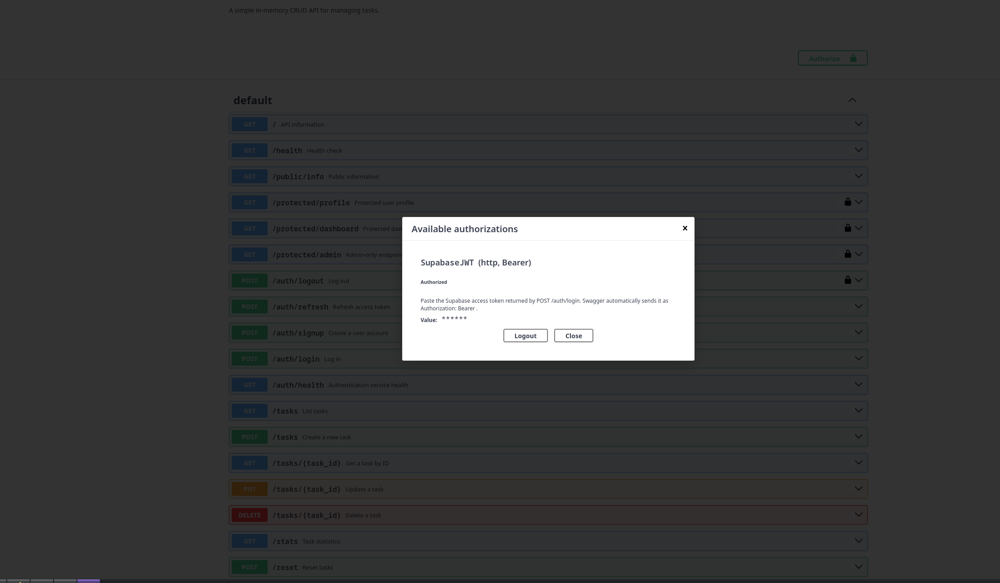

# FastAPI Task API — Supabase Authentication & Protected Routes

A FastAPI backend demonstrating production-style authentication and authorization using Supabase Auth.

This branch extends the original Task API with:

- user signup
- user login
- JWT access tokens
- refresh tokens
- protected routes
- reusable authentication dependencies
- role-based authorization
- logout
- refresh flow
- login rate limiting
- Swagger UI Bearer authentication
- automated security tests

## Architecture

```text
Client
  |
  | email + password
  v
FastAPI -----------------> Supabase Auth
  ^                            |
  |                            |
  | JWT / verified user        |
  +----------------------------+
```

Supabase acts as the Identity Provider.

Passwords are never stored or hashed by this application.

## Security Model

The API distinguishes authentication from authorization:

```text
401 Unauthorized
= the server cannot verify who you are

403 Forbidden
= the server knows who you are, but you are not allowed
```

Examples:

```text
Missing/invalid JWT -> 401
Authenticated non-admin -> 403
```

## Environment Variables

Create a local `.env` file:

```env
SUPABASE_URL=https://your-project.supabase.co
SUPABASE_KEY=your-publishable-key
PORT=8000
```

The real `.env` file is ignored by Git.

A safe template is provided as:

```text
.env.example
```

Never commit:

- service-role keys
- secret keys
- access tokens
- refresh tokens
- passwords

## Setup

Clone the repository and switch to this branch:

```bash
git clone https://github.com/MinaIbrahim10/fastapi-task-api.git
cd fastapi-task-api
git switch w2-a4-supabase-auth
```

Create the environment:

```bash
python3.13 -m venv .venv-auth
source .venv-auth/bin/activate
```

Install dependencies:

```bash
python -m pip install -r requirements-auth.txt
```

Create `.env` from the example:

```bash
cp .env.example .env
```

Then insert your own Supabase project URL and publishable key.

## Run

Start the application with:

```bash
uvicorn main:app --reload
```

Open:

```text
http://127.0.0.1:8000/docs
```

## API Reference

| Method | Endpoint | Authentication | Purpose |
|---|---|---:|---|
| POST | `/auth/signup` | No | Create a Supabase user |
| POST | `/auth/login` | No | Login and receive access + refresh tokens |
| POST | `/auth/logout` | Bearer JWT | End the authenticated session |
| POST | `/auth/refresh` | Refresh token body | Obtain a fresh access token |
| GET | `/public/info` | No | Public information |
| GET | `/protected/profile` | Bearer JWT | Current authenticated user |
| GET | `/protected/dashboard` | Bearer JWT | Second protected route |
| GET | `/protected/admin` | Bearer JWT + admin role | Admin-only route |
| GET | `/auth/health` | No | Safe Supabase configuration health check |

The original Task API endpoints remain available on this branch as well.

## Signup

```bash
curl -X POST http://127.0.0.1:8000/auth/signup \
  -H 'Content-Type: application/json' \
  -d '{"email":"user@example.com","password":"StrongPassword123"}'
```

Successful signup:

```text
HTTP 201 Created
```

## Login

```bash
curl -X POST http://127.0.0.1:8000/auth/login \
  -H 'Content-Type: application/json' \
  -d '{"email":"user@example.com","password":"StrongPassword123"}'
```

Successful login returns:

```json
{
  "access_token": "...",
  "refresh_token": "...",
  "token_type": "bearer",
  "expires_in": 3600
}
```

Tokens should never be committed or logged.

## Protected Route

```bash
curl http://127.0.0.1:8000/protected/profile \
  -H "Authorization: Bearer <ACCESS_TOKEN>"
```

A verified request returns safe user metadata.

Missing or malformed authentication returns:

```json
{
  "error": "Access token required"
}
```

An invalid or tampered token returns:

```json
{
  "error": "Invalid or expired token"
}
```

## Strict Bearer Parsing

The authentication dependency accepts the standard form:

```text
Authorization: Bearer <token>
```

Malformed variations are rejected, including:

```text
Authorization: <token>
Authorization: Basic <token>
Authorization: Bearer
Authorization: Bearer token extra
```

This prevents accidentally accepting malformed authentication headers.

## Reusable Authentication Dependency

Token verification is implemented once in a reusable FastAPI dependency.

That same guard protects:

```text
/protected/profile
/protected/dashboard
/protected/admin
/auth/logout
```

Adding another protected route does not require duplicating authentication logic.

## 401 vs 403

This project demonstrates both authentication and authorization failures.

### 401 Unauthorized

Returned when the identity cannot be trusted:

```text
missing token
malformed Bearer header
expired token
tampered token
invalid login
```

### 403 Forbidden

Returned when authentication succeeds but authorization fails.

For example:

```text
GET /protected/admin
```

A normal authenticated user receives:

```json
{
  "error": "Admin access required"
}
```

with:

```text
HTTP 403 Forbidden
```

## Refresh Tokens

Access tokens are intentionally short-lived.

The login response also provides a refresh token that can obtain a new access token:

```bash
curl -X POST http://127.0.0.1:8000/auth/refresh \
  -H 'Content-Type: application/json' \
  -d '{"refresh_token":"<REFRESH_TOKEN>"}'
```

A real Supabase test confirmed:

```text
refresh request -> 200
new access token -> created
new refresh token -> created
new access token -> protected profile returned 200
```

Short-lived access tokens reduce the useful lifetime of a stolen access credential, while refresh tokens allow a legitimate client to continue a session without repeatedly asking for a password.

## Logout Experiment

A real logout flow was tested against Supabase.

Observed result:

```text
login -> 200
protected route -> 200
logout -> 204
reuse the same access token -> 401
```

For this Supabase session, the logged-out token was rejected on the next verified request.

The important architectural point is that logout behavior depends on how the Identity Provider validates and revokes sessions. Applications should never assume that deleting a token on the client alone is equivalent to server-side session invalidation.

## Login Rate Limiting

Repeated failed login attempts are rate limited.

Current development policy:

```text
5 failed attempts within 60 seconds
```

Further attempts receive:

```text
HTTP 429 Too Many Requests
```

Example response:

```json
{
  "error": "Too many failed login attempts. Try again later."
}
```

Rate limiting belongs near login because authentication endpoints are common brute-force targets.

## JWT Notes

A JWT contains signed claims about a user/session.

Common claims can include:

```text
subject/user ID
issuer
audience
issued-at time
expiry time
authentication metadata
```

A JWT payload is encoded, not encrypted.

Anyone who possesses the token can decode and read its payload, which is why application secrets, passwords, and private credentials must never be stored inside JWT claims.

The signature protects integrity: modifying even one character causes verification to fail.

This was verified manually by modifying a real Supabase access token:

```text
valid token -> HTTP 200
tampered token -> HTTP 401
```

## Swagger UI

FastAPI exposes interactive documentation at:

```text
http://127.0.0.1:8000/docs
```

Protected routes use the `SupabaseJWT` HTTP Bearer security scheme.

Swagger displays lock icons beside protected routes and provides an **Authorize** button.



## Real End-to-End Verification

The implementation was tested with a real Supabase project.

Verified flows:

```text
real signup -> success
real login -> 200
access token returned -> yes
refresh token returned -> yes

protected profile with valid token -> 200
protected profile with tampered token -> 401

protected dashboard -> 200
admin route with normal user -> 403

refresh flow -> 200
refreshed access token -> protected profile 200

logout -> 204
reuse token after logout -> 401

invalid refresh token -> 401
```

## Automated Tests

Run:

```bash
python -m pytest -q
```

Current verified result:

```text
31 passed
```

Tests cover:

- signup
- login
- invalid credentials
- input validation
- public route
- missing bearer token
- malformed bearer headers
- valid token verification
- invalid token rejection
- reusable protected-route dependency
- dashboard protection
- admin authorization
- 403 behavior
- logout
- refresh flow
- invalid refresh tokens
- login rate limiting
- Swagger UI availability
- OpenAPI Bearer security scheme
- protected-route lock metadata
- public-route OpenAPI behavior

## Security Decisions

### No custom password hashing

Supabase handles password storage and cryptography.

The backend does not implement password hashing itself.

### Token Safety

Access tokens and refresh tokens are never intentionally printed in application logs or committed to the repository.

### Publishable Key Only

The project uses the Supabase publishable/anon-style application key.

A `service_role` or secret key must never be used for this exercise.

### Secrets Stay Outside Git

`.env` is ignored and `.env.example` contains placeholders only.

## Project Structure

```text
fastapi-task-api/
├── main.py
├── auth_config.py
├── requirements-auth.txt
├── .env.example
├── .gitignore
├── README.md
├── screenshots/
│   └── auth-swagger.png
└── tests/
    ├── test_auth_stage1.py
    ├── test_auth_stage23.py
    ├── test_auth_stage4_extras.py
    └── test_auth_stage5_swagger.py
```

## Assignment Progress

Core stages:

- [x] Stage 0 — Supabase configuration
- [x] Stage 1 — Signup and login
- [x] Stage 2 — Public and protected gates
- [x] Stage 3 — Real JWT verification
- [x] Stage 4 — Reusable auth dependency and logout
- [x] Stage 5 — Swagger Bearer authentication
- [x] Stage 6 — README and publication preparation

Extras and stretch:

- [x] strict Bearer parsing
- [x] second protected route
- [x] real 403 authorization case
- [x] refresh-token flow
- [x] real logout experiment
- [x] login brute-force rate limiting
- [x] JWT security explanation
- [x] automated auth tests
- [x] OpenAPI security tests
- [x] safe auth configuration health endpoint
- [x] secret-management documentation

Stage 7 AI rematch will be documented after the hand-built implementation is complete.

---

## Stage 7 — AI vs Me Rematch

After completing the authentication system manually, I repeated the task with an AI-generated implementation in an isolated directory.

The purpose was not to replace the hand-built implementation. The goal was to compare engineering decisions, identify prompt omissions, test the generated code against the same real Supabase project, and then improve the prompt once.

### Isolation

The AI implementation was generated under:

```text
ai-auth-version/
├── main.py
├── main-v2.py
├── prompt-v1.txt
├── prompt-v2.txt
├── requirements.txt
├── diff-hand-v1.txt
├── diff-hand-v2.txt
└── diff-v1-v2.txt
```

The production implementation in the repository root was not replaced.

### Prompt V1

The first prompt asked the AI to build:

- signup
- login
- logout
- public route
- protected profile
- protected dashboard
- reusable authentication dependency
- Supabase token verification
- Swagger Bearer authentication
- correct HTTP status codes
- safe token handling

The complete original prompt is preserved in:

```text
ai-auth-version/prompt-v1.txt
```

### V1 Result

V1 passed Python syntax validation but failed at runtime.

The generated implementation expected:

```text
SUPABASE_ANON_KEY
```

while the real project configuration used:

```text
SUPABASE_KEY
```

The result was:

```text
RuntimeError:
SUPABASE_URL and SUPABASE_ANON_KEY must be configured
```

This demonstrated an important distinction:

```text
syntax-valid != runtime-ready
```

The AI also chose raw HTTP calls through `httpx` instead of the Supabase Python SDK.

That implementation was preserved rather than silently repaired.

### Prompt V2 — The Rematch

The second prompt was written after reviewing the concrete V1 failure.

It explicitly required:

```text
SUPABASE_URL
SUPABASE_KEY
```

and prohibited inventing another environment-variable name.

It also explicitly required:

```text
official Supabase Python SDK
create_client(...)
supabase.auth.sign_up(...)
supabase.auth.sign_in_with_password(...)
supabase.auth.get_user(...)
```

The full rematch prompt is preserved in:

```text
ai-auth-version/prompt-v2.txt
```

### V2 Runtime Verification

The second AI implementation was tested against the real Supabase project.

Observed results:

```text
application startup                 -> success
public route                        -> 200
protected route without token       -> 401
real login                          -> 200
access token returned               -> yes
refresh token returned              -> yes
valid access token                  -> 200
protected dashboard                 -> 200
tampered access token               -> 401
Basic authorization header          -> 401
Bearer without token                -> 401
Bearer with extra token component   -> 401
Swagger /docs                       -> 200
Bearer security scheme              -> present
logout                              -> 204
reuse access token after logout     -> 200
```

No obvious access token or refresh token was found in the AI server logs.

### Hand-Built vs AI — Concrete Differences

#### 1. Configuration compatibility

**AI V1**

Invented a new configuration name:

```text
SUPABASE_ANON_KEY
```

This caused the application to fail during startup against the existing environment.

**Hand-built implementation**

Used the established project variables:

```text
SUPABASE_URL
SUPABASE_KEY
```

and was verified against the real project before publication.

**Lesson**

A prompt must specify configuration contracts explicitly. A generated implementation can be syntactically correct while still being operationally incompatible.

---

#### 2. Supabase integration strategy

**AI V1**

Used raw `httpx` requests to Supabase Auth.

**Hand-built implementation**

Used the official Supabase Python SDK and its authentication methods.

**AI V2**

Changed to the SDK only after the rematch prompt explicitly required it.

**Lesson**

"Use Supabase" is ambiguous. If the integration mechanism matters, the prompt needs to state whether the official SDK or direct HTTP API is expected.

---

#### 3. Runtime validation caught a failure syntax checks missed

**AI V1**

```text
syntax check -> passed
server startup -> failed
```

**Hand-built implementation**

Was validated through:

```text
syntax checks
automated tests
real signup
real login
real JWT verification
tampered-token test
refresh flow
logout flow
Swagger/OpenAPI verification
```

**Lesson**

Compilation or syntax validation is not enough for authentication code. External identity-provider integrations require real runtime checkpoints.

---

#### 4. Logout behavior differed

The hand-built implementation produced:

```text
logout -> 204
reuse access token -> 401
```

The AI V2 implementation produced:

```text
logout -> 204
reuse access token -> 200
```

This is an important authentication-system observation.

JWT access tokens can remain usable depending on session-revocation behavior and how the authentication client performs logout. Therefore, receiving `204` from a logout endpoint alone does not prove that an already-issued access token has immediately become unusable.

The correct behavior should be measured rather than assumed.

---

#### 5. User-data exposure

The hand-built profile response uses an explicit allow-list of safe fields:

```text
id
email
created_at
```

The AI V2 profile also returned `user_metadata`.

Even when metadata is not secret, returning only fields required by the API contract reduces unnecessary data exposure.

**Lesson**

For security-sensitive responses, explicit response shaping is preferable to returning a broad identity-provider object.

---

#### 6. Scope and defense-in-depth

The hand-built implementation additionally contains:

```text
403 admin authorization
refresh-token endpoint
login failure rate limiting
strict Bearer parsing tests
OpenAPI security tests
real logout experiment
Git secret-history audit
31 automated tests
```

These features were intentionally added as stretch work after the core authentication requirements were stable.

The AI comparison was kept isolated so generated code could not silently regress the production implementation.

### Prompt Engineering Lesson

The largest V1 problem was not that the AI could not write authentication code.

The problem was that the first prompt left important implementation contracts open to interpretation.

The rematch improved the prompt by explicitly specifying:

```text
exact environment-variable names
official Supabase SDK
specific SDK methods
strict Bearer parsing behavior
real token verification
dependency requirements
file isolation
security constraints
```

V2 then progressed from:

```text
syntax-valid but unable to start
```

to:

```text
real login -> 200
valid token -> 200
tampered token -> 401
Swagger security -> working
logout -> 204
```

The remaining logout-token behavior also showed why generated authentication code must still be tested empirically.

### Final AI vs Me Conclusion

AI was useful for producing a second implementation quickly, but the hand-built workflow was stronger at:

- environment compatibility
- runtime verification
- minimizing returned user data
- explicit authorization behavior
- defensive testing
- secret hygiene
- understanding logout semantics

The most useful role of AI in this exercise was therefore not replacing engineering judgment, but acting as a second implementation that could be tested, challenged, and improved through better prompting.
