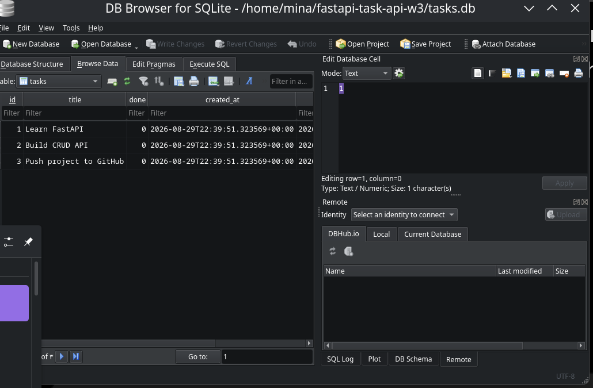

# FastAPI Task API — SQLite Persistence

A persistent CRUD API built with FastAPI and SQLite.

This project is the database-backed evolution of the original in-memory Task API. The public API remains the same while the storage layer has been replaced with SQLite.

## Architecture

Before:

```text
Client -> FastAPI -> Python list in memory
```

Now:

```text
Client -> FastAPI -> SQL queries -> SQLite -> tasks.db
```

The client does not need to know where the data is stored.

## Why SQLite?

SQLite was chosen because it:

- requires no separate database server
- stores the complete database in one local file
- supports real SQL
- is lightweight and portable
- provides persistent storage across application restarts
- is ideal for learning relational database fundamentals

The database file is:

```text
tasks.db
```

It is created automatically when the application starts and is intentionally ignored by Git.

## Database Schema

The `tasks` table contains:

| Column | Type | Purpose |
|---|---|---|
| `id` | INTEGER | Primary key |
| `title` | TEXT | Task title |
| `done` | INTEGER | Completion status |
| `created_at` | TEXT | UTC creation timestamp |
| `updated_at` | TEXT | UTC modification timestamp |

Three sample tasks are inserted automatically only when the table is empty.

Restarting the application does not duplicate them.

## API Endpoints

| Method | Endpoint | Purpose |
|---|---|---|
| GET | `/` | API information |
| GET | `/health` | Health check |
| GET | `/tasks` | List tasks |
| GET | `/tasks/{id}` | Get one task |
| POST | `/tasks` | Create a task |
| PUT | `/tasks/{id}` | Update a task |
| DELETE | `/tasks/{id}` | Delete a task |
| GET | `/stats` | SQL-backed task statistics |
| POST | `/reset` | Restore sample tasks |

The CRUD API keeps the same behavior as the original in-memory version.

Unknown task IDs return HTTP `404`.

Invalid requests return HTTP `400`.

Successful task creation returns HTTP `201`.

Successful deletion returns HTTP `204`.

## Persistence

Task data is stored using SQLite SQL statements rather than an in-memory Python array.

For example:

```sql
SELECT id, title, done
FROM tasks
ORDER BY id;
```

Creating a task uses `INSERT`, updating uses `UPDATE`, and deleting uses `DELETE`.

Data remains available after the FastAPI process stops and starts again.

## SQL Exploration

The database was modified directly with SQLite to verify that API responses reflect database state immediately.

The following queries were executed manually:

```sql
SELECT * FROM tasks;

SELECT * FROM tasks WHERE done = 1;

SELECT COUNT(*) FROM tasks;

UPDATE tasks SET done = 1;

DELETE FROM tasks WHERE done = 1;
```

After running:

```sql
UPDATE tasks SET done = 1;
```

`GET /tasks` immediately returned every task with:

```json
"done": true
```

and `GET /stats` returned:

```json
{
  "total": 3,
  "done": 3,
  "open": 0
}
```

This proves that the API reads the current SQLite database state rather than relying on an in-memory copy.

## Extra Features

Beyond the core assignment requirements, this implementation includes several additional SQL-backed features.

### SQL Search

```http
GET /tasks?search=fastapi
```

Implemented using SQL `LIKE`.

### SQL Completion Filtering

```http
GET /tasks?done=true
```

Implemented using a SQL `WHERE` condition.

### SQL Pagination

```http
GET /tasks?limit=2&offset=1
```

Implemented using SQL `LIMIT` and `OFFSET`.

### SQL Statistics

```http
GET /stats
```

Statistics are calculated directly by SQLite instead of counting Python list items.

Example query:

```sql
SELECT
    COUNT(*) AS total,
    SUM(CASE WHEN done = 1 THEN 1 ELSE 0 END) AS completed
FROM tasks;
```

### Timestamps

Every database row stores:

- `created_at`
- `updated_at`

`created_at` records when the task is created.

`updated_at` changes whenever the task is modified.

### SQL Reset

```http
POST /reset
```

Restores the original three sample tasks using SQL operations.

## Database Screenshot

The repository includes a screenshot showing the SQLite `tasks` table.

```text
screenshots/sqlite-database.png
```



## Setup

Clone the repository:

```bash
git clone https://github.com/MinaIbrahim10/fastapi-task-api.git
cd fastapi-task-api
git switch w3-a1-sqlite-persistence
```

Create a virtual environment:

```bash
python3.13 -m venv .venv
source .venv/bin/activate
```

Install dependencies:

```bash
python -m pip install -r requirements.txt
```

Start the API:

```bash
uvicorn main:app --reload
```

Open the interactive API documentation:

```text
http://127.0.0.1:8000/docs
```

The SQLite database and `tasks` table are created automatically when the application starts.

## Example Requests

### List all tasks

```bash
curl http://127.0.0.1:8000/tasks
```

### Get one task

```bash
curl http://127.0.0.1:8000/tasks/1
```

### Create a task

```bash
curl -X POST http://127.0.0.1:8000/tasks \
  -H 'Content-Type: application/json' \
  -d '{"title":"Persistent task"}'
```

Successful creation returns HTTP `201`.

### Update a task

```bash
curl -X PUT http://127.0.0.1:8000/tasks/1 \
  -H 'Content-Type: application/json' \
  -d '{"title":"Updated task","done":true}'
```

### Delete a task

```bash
curl -X DELETE http://127.0.0.1:8000/tasks/1
```

Successful deletion returns HTTP `204`.

### Search

```bash
curl 'http://127.0.0.1:8000/tasks?search=fastapi'
```

### Filter completed tasks

```bash
curl 'http://127.0.0.1:8000/tasks?done=true'
```

### Pagination

```bash
curl 'http://127.0.0.1:8000/tasks?limit=2&offset=1'
```

### Statistics

```bash
curl http://127.0.0.1:8000/stats
```

### Reset database tasks

```bash
curl -X POST http://127.0.0.1:8000/reset
```

## Persistence Verification

Create a new task:

```bash
curl -X POST http://127.0.0.1:8000/tasks \
  -H 'Content-Type: application/json' \
  -d '{"title":"Persist after restart"}'
```

Stop FastAPI and start it again:

```bash
uvicorn main:app --reload
```

Then request the tasks again:

```bash
curl http://127.0.0.1:8000/tasks
```

The newly created task remains present because it is stored in `tasks.db`.

The three initial example tasks are also inserted only when the table is empty, so repeated application restarts do not create duplicate seed data.

## Validation and Errors

Missing or empty titles return:

```text
HTTP 400 Bad Request
```

Example:

```json
{
  "error": "Title is required and cannot be empty"
}
```

Updating a task without supplying any fields returns:

```text
HTTP 400 Bad Request
```

Unknown task IDs return:

```text
HTTP 404 Not Found
```

Example:

```json
{
  "error": "Task 999 not found"
}
```

## Automated Tests

Run:

```bash
python -m pytest -q
```

The test suite verifies:

- automatic database initialization
- seed tasks are inserted only once
- database-backed task reads
- unknown task 404 handling
- task creation
- database persistence
- task updates
- task deletion
- HTTP 400 validation
- SQL search
- SQL completion filtering
- SQL pagination
- SQL statistics
- SQL-backed reset behavior

## Manual SQL Verification

The database can be inspected directly with the SQLite CLI:

```bash
sqlite3 tasks.db
```

Useful commands:

```sql
.headers on
.mode column
SELECT * FROM tasks;
```

Example completed-task query:

```sql
SELECT * FROM tasks WHERE done = 1;
```

Count all rows:

```sql
SELECT COUNT(*) FROM tasks;
```

Mark all tasks as complete:

```sql
UPDATE tasks SET done = 1;
```

Delete completed tasks:

```sql
DELETE FROM tasks WHERE done = 1;
```

Changes made directly in SQLite are immediately visible through the API because all task reads come from the database.

## Project Structure

```text
fastapi-task-api/
├── main.py
├── requirements.txt
├── README.md
├── .gitignore
├── screenshots/
│   └── sqlite-database.png
├── tests/
│   └── test_api.py
└── tasks.db
```

`tasks.db` is generated locally and ignored by Git.

## Assignment Evolution

The purpose of this version is to demonstrate that persistence can change without changing the public API.

Assignment 1 architecture:

```text
Client -> API -> Python list
```

Current architecture:

```text
Client -> API -> SQL -> SQLite
```

From the client's perspective:

```text
Same endpoints
Same request bodies
Same response behavior
Different storage implementation
```

This separation between the API layer and data layer is one of the foundations of backend engineering.

The original in-memory Assignment 1 implementation remains available on the `main` branch.

The SQLite-backed implementation for W3 · A1 is available on:

```text
w3-a1-sqlite-persistence
```

## Technologies

- Python 3.13
- FastAPI
- SQLite
- Pydantic
- Uvicorn
- Pytest
- HTTPX

## Status

Core assignment requirements:

- [x] Same CRUD API as Assignment 1
- [x] SQLite persistence
- [x] Automatic database creation
- [x] Automatic table creation
- [x] Three first-run example tasks
- [x] Persistent data across restarts
- [x] SQL-based reads
- [x] SQL-based inserts
- [x] SQL-based updates
- [x] SQL-based deletes
- [x] HTTP 404 for unknown IDs
- [x] HTTP 400 validation
- [x] Manual SQL exploration

Extra features:

- [x] SQL search
- [x] SQL completion filtering
- [x] SQL pagination
- [x] SQL statistics
- [x] created_at timestamps
- [x] updated_at timestamps
- [x] SQL-backed reset endpoint
- [x] automated API/database tests

